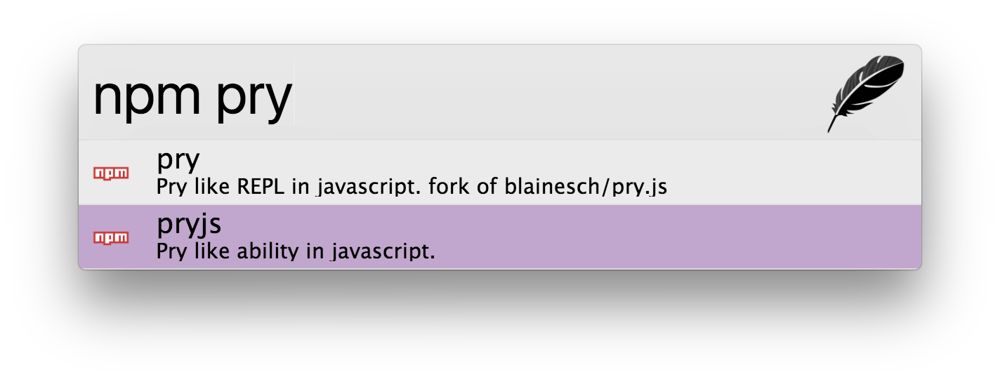

# zazu-npms [](https://travis-ci.org/danielbayerlein/zazu-npms)

> [Zazu](https://github.com/tinytacoteam/zazu) plugin to search for npm packages with [npms.io](https://npms.io/)

## Usage

To search npm simply type `npm` then the name of the package to search for. For
example `npm pry`.



## Install

Add `danielbayerlein/zazu-npms` inside of plugins block of your `~/.zazurc.json` file.

```json
{
  "plugins": [
    "danielbayerlein/zazu-npms"
  ]
}
```

## License

Copyright (c) 2017 Daniel Bayerlein. See [LICENSE](./LICENSE.md) for details.
